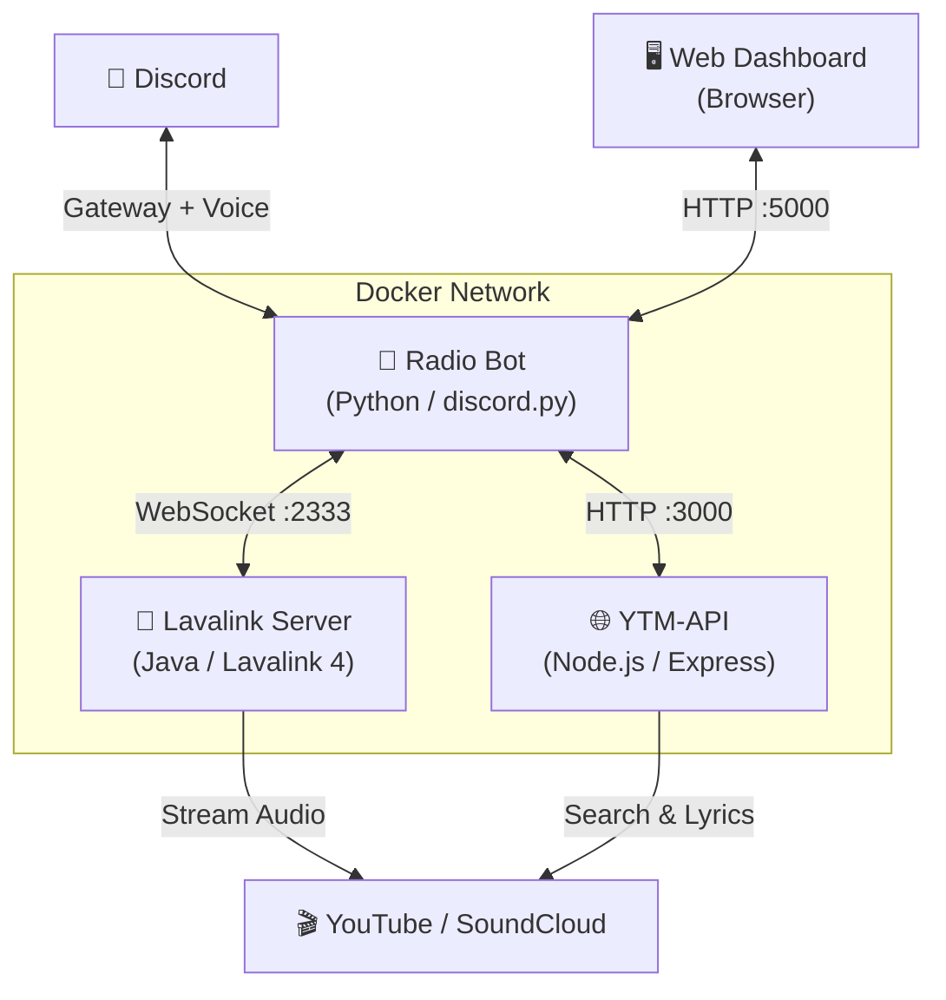

# 📻 Radio SSFM v2 — Discord Bot + Web Dashboard

Bot Discord multi-fungsi yang menggabungkan **Radio Streaming 24/7** dengan **Music Player** (Autoplay Engine), lengkap dengan **Web Dashboard** untuk kontrol dari browser.

---

## 🏗️ Arsitektur Sistem



### Komponen

| Service | Teknologi | Port | Fungsi |
|---------|-----------|------|--------|
| `radio-bot` | Python 3.11 + discord.py + wavelink | 5000 | Bot Discord + Web Dashboard |
| `lavalink` | Lavalink 4 (Java) | 2333 | Audio processing & streaming ke Discord |
| `ytm-api` | Node.js + Express | 3000 (internal) | YouTube Music search, lyrics, recommendations |

---

## ✨ Fitur

### 📻 Radio Mode
- Streaming radio 24/7 (FFmpeg)
- Multi-stasiun (tambah/hapus/ganti)
- Auto-reconnect saat koneksi putus
- Auto-join voice channel target

### 🎵 Music Mode
- Request lagu via judul atau link YouTube
- **Autoplay Engine** — otomatis putar rekomendasi saat antrian habis
- Queue management (skip, shuffle, view queue)
- Lyrics search via YTM-API
- Fallback: YouTube → SoundCloud

### 🖥️ Web Dashboard
- Kontrol bot dari browser (play, stop, skip, shuffle, request)
- Real-time monitoring (CPU, RAM, Temp, Ping, Uptime)
- Kelola stasiun radio (tambah, hapus, play)
- Lihat antrian musik secara real-time
- Live log viewer
- Responsive design (mobile & desktop)

### 💬 Discord UI (Dashboard Interaktif)
- Unified Dashboard dengan tombol mode switch
- Request lagu via modal popup
- Tombol Skip, Shuffle, Queue, Lyrics
- Dropdown pemilih stasiun radio
- **Clean chat** — pesan Now Playing & Menu otomatis terhapus/diperbarui

---

## 🚀 Instalasi & Deployment

### Prasyarat
- Docker & Docker Compose
- Discord Bot Token ([Discord Developer Portal](https://discord.com/developers/applications))
- Voice Channel ID target

### 1. Clone & Konfigurasi

```bash
# Clone atau copy project
cd Radio.v2

# Buat file .env
cp .env.example .env
```

Edit `.env`:
```env
DISCORD_TOKEN=your_discord_bot_token_here

# ID Voice Channel target (pisah koma jika lebih dari satu)
TARGET_CHANNEL_ID=123456789012345678
```

### 2. Build & Jalankan

```bash
docker compose up -d --build
```

### 3. Akses

- **Web Dashboard**: `http://<IP_SERVER>:5000`
- **Discord**: Bot akan otomatis join voice channel dan mulai streaming

### Restart / Rebuild

```bash
# Restart semua service
docker compose restart

# Rebuild setelah edit kode
docker compose up -d --build

# Lihat log
docker compose logs -f radio-bot
```

---

## ⚙️ Konfigurasi

### Environment Variables (`.env`)

| Variable | Wajib | Keterangan |
|----------|-------|------------|
| `DISCORD_TOKEN` | ✅ | Token bot Discord |
| `TARGET_CHANNEL_ID` | ✅ | ID voice channel target (pisah koma) |
| `YTM_API_URL` | ❌ | URL YTM-API (default: `http://ytm-api:3000`) |

### `config.py`

| Setting | Default | Keterangan |
|---------|---------|------------|
| `AUTOPLAY_QUEUE_SIZE` | `1` | Jumlah lagu rekomendasi per-fetch |
| `MAX_HISTORY_SIZE` | `50` | Batas history per guild |
| `FFMPEG_OPTS` | (lihat file) | Opsi FFmpeg untuk radio streaming |

### `lavalink/application.yml`

Konfigurasi Lavalink server:
- Port: `2333`
- Password: sesuaikan di `main.py` juga
- YouTube OAuth: opsional, untuk bypass rate-limit
- Source: SoundCloud, Bandcamp, Twitch aktif

---

## 📝 Daftar Command Discord

Prefix: `!pndq`

### Dashboard
| Command | Keterangan |
|---------|------------|
| `!pndq menu` | Tampilkan dashboard interaktif (Radio + Music) |
| `!pndq status` | Cek status sistem (CPU, RAM, Ping, Mode) |
| `!pndq help` | Tampilkan bantuan |

### Radio
| Command | Keterangan |
|---------|------------|
| `!pndq radio` | Switch ke mode Radio |
| `!pndq liststation` | Lihat daftar stasiun radio |
| `!pndq addstation "Nama" "URL"` | Tambah stasiun radio |
| `!pndq delstation Nama` | Hapus stasiun radio |

### Music
| Command | Keterangan |
|---------|------------|
| `!pndq play <judul/link>` | Request lagu (otomatis switch ke Music mode) |
| `!pndq skip` | Lewati lagu yang diputar |
| `!pndq stop` | Hentikan & bersihkan antrian |
| `!pndq queue` | Lihat antrian lagu |
| `!pndq shuffle` | Acak urutan antrian |
| `!pndq lyrics <judul>` | Cari lirik lagu |

### Utility
| Command | Keterangan |
|---------|------------|
| `!pndq reload <cog>` | Reload module (cth: `cogs.music`) |

---

## 🌐 API Endpoints (Web Dashboard)

Base URL: `http://<IP>:5000`

| Method | Endpoint | Keterangan |
|--------|----------|------------|
| GET | `/` | Halaman dashboard |
| GET | `/api/guilds` | Data semua server (mode, now playing, queue) |
| GET | `/api/stats` | System health (CPU, RAM, Temp, Ping, Uptime) |
| GET | `/api/logs` | Live logs |
| GET | `/api/stations` | Daftar stasiun radio |
| POST | `/api/stations` | Tambah stasiun (form: `name`, `url`) |
| DELETE | `/api/stations/<name>` | Hapus stasiun radio |
| GET | `/api/control/play/<name>?guild_id=` | Play stasiun radio |
| GET | `/api/control/stop?guild_id=` | Stop playback |
| POST | `/api/control/skip?guild_id=` | Skip lagu |
| POST | `/api/control/request?guild_id=` | Request lagu (JSON: `{query}`) |
| POST | `/api/control/shuffle?guild_id=` | Shuffle antrian |
| POST | `/api/control/mode/<radio\|music>?guild_id=` | Switch mode |

---

## 📂 Struktur Folder

```
Radio.v2/
├── main.py                  # Entry point bot
├── config.py                # Konfigurasi terpusat
├── Dockerfile               # Docker build instructions
├── docker-compose.yml       # Multi-service orchestration
├── requirements.txt         # Python dependencies
├── .env                     # Environment variables (jangan commit!)
├── .env.example             # Template env
│
├── cogs/                    # Discord bot modules (Cogs)
│   ├── radio.py             # Radio streaming + Dashboard handler
│   ├── music.py             # Music player + Autoplay engine
│   └── web.py               # Web dashboard (Quart server)
│
├── views/                   # Discord UI Components
│   ├── dashboard_ui.py      # DashboardView, buttons, modals, embeds
│   └── radio_ui.py          # Backward-compat re-export
│
├── utils/                   # Utility modules
│   ├── mode_manager.py      # Per-guild state management (mode, queue, history)
│   └── storage.py           # JSON persistence (stations)
│
├── templates/
│   └── index.html           # Web dashboard UI
│
├── data/                    # Persistent data (auto-created)
│   ├── stations.json        # Daftar stasiun radio
│   └── music_history.json   # History lagu per guild
│
├── lavalink/
│   └── application.yml      # Lavalink server configuration
│
└── ytm_api/                 # YouTube Music API proxy service
    ├── server.js             # Express API server
    ├── package.json          # Node.js dependencies
    └── test_player.js        # Testing utility (opsional)
```

---

## 🔧 Troubleshooting

### Bot tidak join voice channel
- Pastikan `TARGET_CHANNEL_ID` di `.env` sudah benar
- Pastikan bot punya permission `Connect` dan `Speak` di channel tersebut
- Cek log: `docker compose logs -f radio-bot`

### Lagu tidak bisa diputar
- Cek apakah Lavalink running: `docker compose logs lavalink`
- Pastikan password Lavalink di `application.yml` cocok dengan `main.py`
- YouTube mungkin rate-limit — pertimbangkan isi OAuth refresh token di `application.yml`

### Web dashboard error 502 / tidak bisa diakses
- Pastikan port `5000` terbuka di firewall
- Cek apakah Quart server running di log bot

### Antrian tidak berjalan (lagu berikutnya tidak diputar)
- Pastikan event `on_wavelink_track_end` berjalan — cek log untuk `DEBUG TrackEnd`
- Ini biasanya karena `reason` yang tidak dikenali dari Wavelink. Sudah diperbaiki dengan string matching.

### Bot error setelah restart (menu Discord tidak bisa diklik)
- Menu/dashboard Discord yang dikirim sebelum restart memang tidak bisa dipakai lagi karena View timeout
- Panggil `!pndq menu` ulang untuk menampilkan menu baru yang valid

---

## 📜 Lisensi

Proyek ini dibuat untuk keperluan internal. Silakan sesuaikan dengan kebutuhan Anda.
